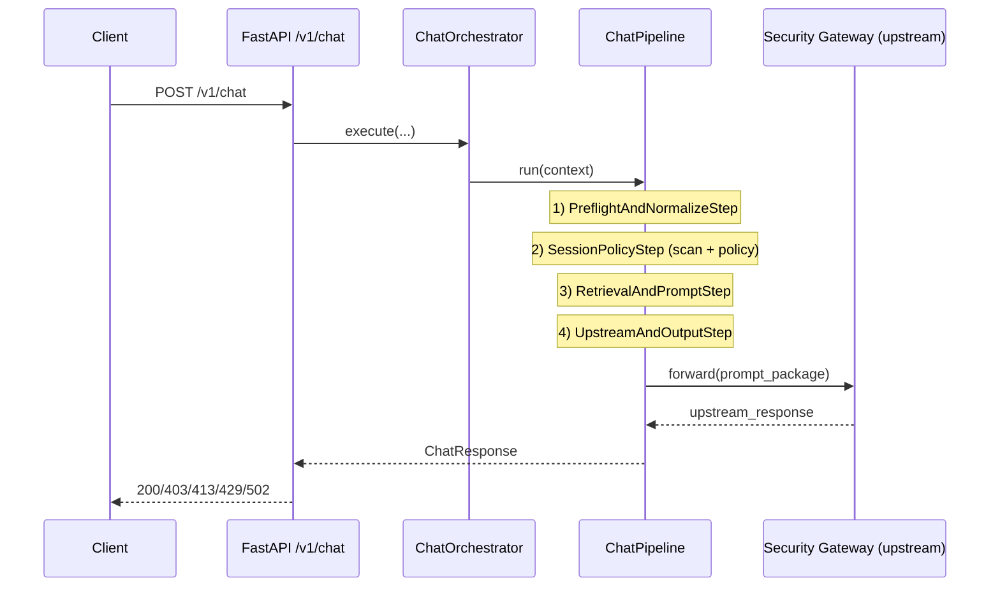

# SafetyGuard — Architecture visuelle

## 1) Vue globale du traitement

```text
Client
  │
  ▼
FastAPI (main.py)
  │
  ▼
ChatOrchestrator
  │
  ▼
ChatPipeline
  ├─ 1. PreflightAndNormalizeStep
  ├─ 2. SessionPolicyStep
  ├─ 3. RetrievalAndPromptStep
  └─ 4. UpstreamAndOutputStep
  │
  ▼
ChatResponse
```

## 2) Séquence principale



## 3) Détails des 4 étapes

```text
1) PreflightAndNormalizeStep
   - validation taille requête
   - identification client
   - normalisation vers CanonicalRequestEnvelope

2) SessionPolicyStep
   - session manager + risk engine
   - input scanner + dlp scanner + llm guard
   - content classifier
   - policy decision (allow/restrict/deny/challenge)

3) RetrievalAndPromptStep
   - retrieval context filtré
   - tool gateway (évaluation + exécution autorisée)
   - prompt builder (sections par niveau de confiance)
   - contrôle budget prompt

4) UpstreamAndOutputStep
   - appel upstream
   - llm output guard + output guard
   - action finale: allow/redact/block
   - audit et decision logging
```

## 4) Frontières de confiance

```text
Trusted
  - system policy
  - developer task

Semi-trusted
  - retrieved context
  - assistant history

Untrusted
  - user input
  - attachment metadata/content
```

## 5) Arbre décisionnel policy (résumé)

```text
Si missing_permission -> deny
Sinon si prompt injection / jailbreak / moderation bypass -> deny
Sinon si contenu sensible/risqué -> allow_with_restrictions ou challenge
Sinon -> allow
```

## 6) Topologie de déploiement (logique)

```text
[Client]
   |
[SafetyGuard API]
   |---> [Retrieval Backend]
   |---> [Guard Model Endpoint]
   |---> [Security Gateway Upstream]
  \---> [State Store (SQLite local)]
```

## 7) Observabilité

```text
- Trace ID par requête (middleware)
- AuditBus: événements sécurité
- DecisionLogger: décisions + timings par étape
```
